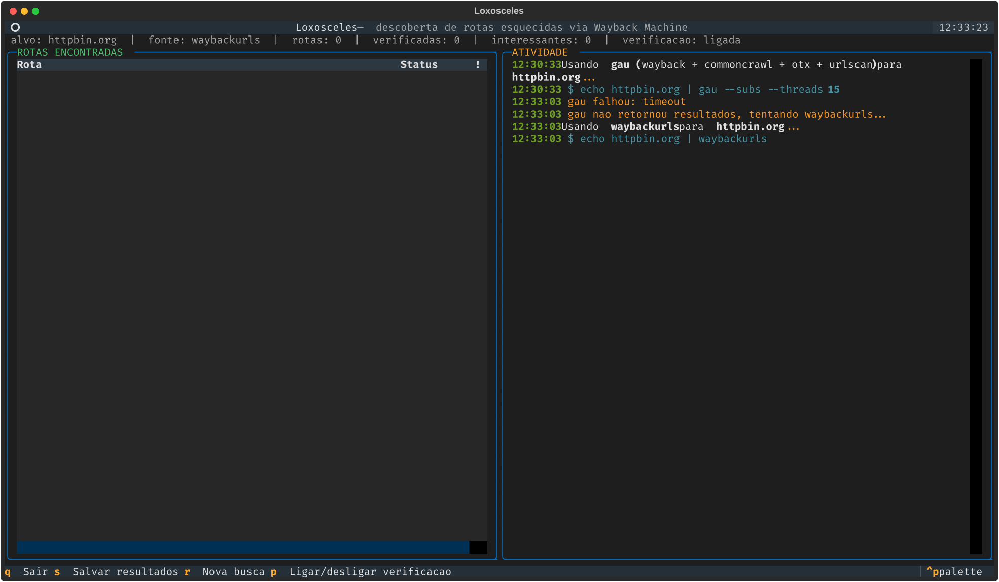

# 🕷️ Loxosceles

**Loxosceles** é uma ferramenta de recon para pentest que vasculha o histórico do **Wayback Machine** (e outras fontes) atrás de rotas esquecidas de um site — painéis antigos, backups, endpoints de API, arquivos de config — tudo que já existiu publicamente em algum momento e pode ter ficado pra trás sem ninguém lembrar.


## Como funciona

1. **Coleta** — busca todas as URLs já arquivadas de um domínio, em cascata automática:
   - [`gau`](https://github.com/lc/gau) se estiver instalado (agrega Wayback Machine + Common Crawl + AlienVault OTX + URLScan — a fonte mais completa)
   - senão [`waybackurls`](https://github.com/tomnomnom/waybackurls) (só Wayback Machine)
   - senão, consulta a CDX API do Wayback Machine diretamente (funciona sem nenhuma dependência externa, com fallback próprio para os timeouts que a API costuma dar)
2. **Deduplica** por rota (ignorando query string) e organiza tudo numa tabela.
3. **Verifica ao vivo** — dispara `curl -I` contra o site atual pra cada rota encontrada, pra saber se ainda responde e com qual status.
4. **Destaca** rotas potencialmente sensíveis (`.env`, `.git`, `/admin`, backups, `wp-admin`, `.sql`, chaves privadas, etc).

Tudo isso numa interface de terminal dividida em duas: rotas encontradas de um lado, atividade ao vivo (os comandos reais rodando) do outro.

## Instalação

Requer Python 3.10+ e `curl`. Opcionalmente, [`gau`](https://github.com/lc/gau) e/ou [`waybackurls`](https://github.com/tomnomnom/waybackurls) instalados (via `go install`) pra fontes mais completas — sem eles a ferramenta cai automaticamente para a busca manual na CDX API.

```bash
git clone https://github.com/Jugolino/Loxosceles.git
cd Loxosceles
./install.sh
```

O `install.sh` cria um ambiente virtual isolado (não mexe no seu Python do sistema) e instala o comando `Loxosceles` em `~/.local/bin`. Depois disso, rode de qualquer lugar:

```bash
Loxosceles seudominio.com
```

## Uso

```bash
Loxosceles exemplo.com                        # busca completa com verificacao ao vivo
Loxosceles exemplo.com --no-probe             # so lista as rotas, sem verificar
Loxosceles exemplo.com --source waybackurls   # forca uma fonte especifica
Loxosceles exemplo.com --limit 3000 --concurrency 30
```

| Flag | Descrição |
|---|---|
| `--source {auto,gau,waybackurls,wayback}` | Fonte de coleta (default: `auto`, detecta o que está instalado) |
| `--limit N` | Limite de URLs buscadas na CDX API manual (default: 20000) |
| `--concurrency N` | Requisições `curl` simultâneas na verificação (default: 20) |
| `--no-probe` | Não verifica ao vivo, só lista |

### Atalhos dentro do app

| Tecla | Ação |
|---|---|
| `s` | Salva os resultados em JSON (`results/`) |
| `r` | Nova busca (outro domínio) |
| `p` | Liga/desliga a verificação ao vivo |
| `q` | Sai |

## Fallback em cascata na prática

Se a fonte preferida falhar ou não estiver instalada, a ferramenta cai pra próxima automaticamente e avisa no próprio log de atividade:



## Aviso legal

Use apenas em domínios que você tem autorização explícita para testar (programas de bug bounty, pentest contratado, seus próprios projetos). Rotas encontradas no Wayback Machine podem incluir informação sensível — trate os resultados com responsabilidade e reporte achados por canais adequados de disclosure.

## Licença

MIT
